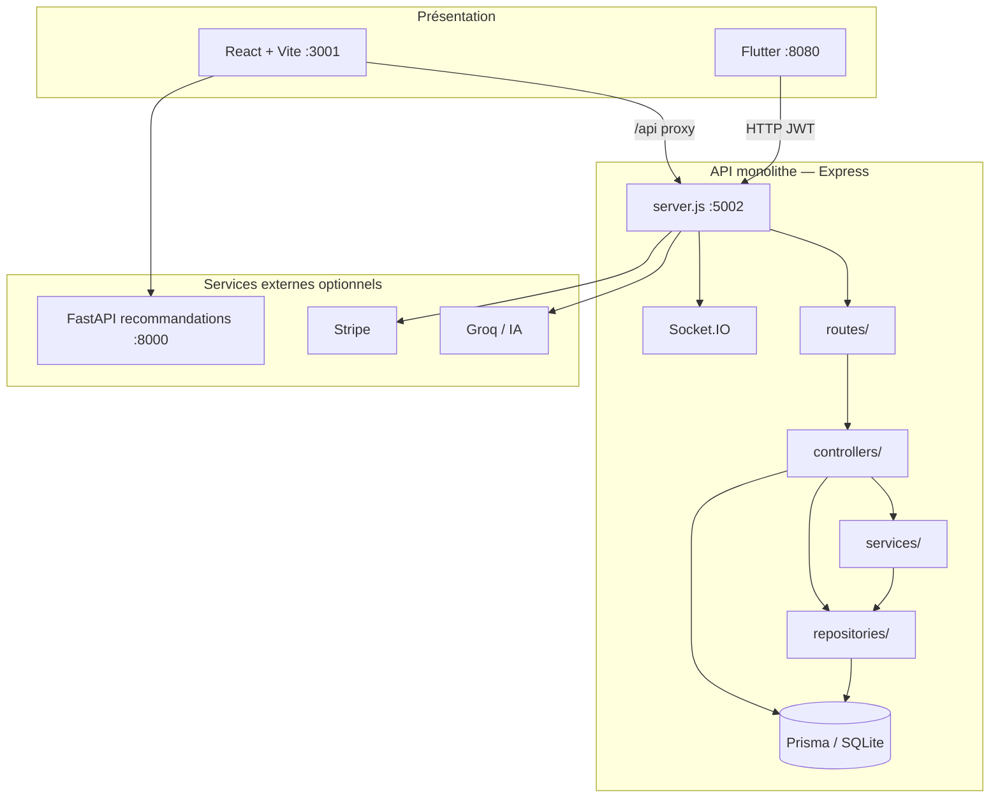

# Architecture PetfoodTN

Ce document décrit l’architecture du projet **PetfoodTN** : organisation **MVC en couches** côté backend, application **React** côté frontend, et API **monolithe** (un seul serveur Node.js).

---

## 1. Vue d’ensemble



| Composant | Technologie | Port par défaut |
|-----------|-------------|-----------------|
| Frontend web | React 18, Vite, React Router | 3001 |
| API principale | Node.js, Express | 5002 |
| Base de données | SQLite via Prisma | `backend/prisma/dev.db` |
| App mobile | Flutter | 8080 (web) |
| Recommandations IA (optionnel) | FastAPI | 8000 |

---

## 2. Principes architecturaux

### 2.1 MVC backend (layered architecture)

Le backend suit un **MVC étendu** en quatre couches :

| Couche | Rôle | Responsabilité |
|--------|------|----------------|
| **Routes** | « Entrée HTTP » | Chemins, verbes, middleware (`auth`, `adminAuth`, `vetAuth`) |
| **Controllers** | **C** — Contrôleur | Lire `req`, appeler la logique, renvoyer `res` (status, JSON) |
| **Services** | Logique métier | Règles, validations, orchestration, indépendant d’Express |
| **Repositories** | Accès données | Requêtes Prisma, filtres par rôle |
| **Models** | **M** — Modèle | Schéma Prisma (`prisma/schema.prisma`) |

La **vue** côté API est le JSON renvoyé au client ; il n’y a pas de templates serveur.

**Flux recommandé (exemple commandes) :**

```
Client HTTP
  → routes/orders.routes.js
  → controllers/order.controller.js
  → services/order.service.js
  → repositories/order.repository.js
  → Prisma → SQLite
```

**État actuel :** les modules **orders**, **products** et **users** respectent bien ce flux. D’autres modules (auth, events, veterinary appointments) appellent encore Prisma directement dans le controller — à migrer progressivement vers `service` + `repository`.

### 2.2 Frontend React (MV*)

React n’est pas du MVC classique. On peut le lire ainsi :

| Rôle | Emplacement |
|------|-------------|
| **Vue** | `src/pages/`, `src/components/`, `src/layouts/` |
| **État / contrôle** | `src/contexts/` (`AuthContext`, `ThemeContext`), hooks |
| **Accès API** | `src/utils/api.js` (Axios + JWT) |
| **Routage** | `src/App.js` (`RoleRoute`, layouts Admin / Client / Livreur / Vet) |

### 2.3 Monolithe (choix retenu)

**Un seul processus** `backend/server.js` (port 5002) expose toutes les routes `/api/*` via `gateway/registerRoutes.js`.

Pas de proxy vers des services séparés : les variables `*_SERVICE_URL` dans `.env` sont **ignorées** (avertissement au démarrage si présentes).

Le dossier `backend/microservices/` est **legacy** (non utilisé en dev ni en prod).

---

## 3. Structure des dossiers

### 3.1 Racine `frontend Lido/`

```
frontend Lido/
├── src/                    # Frontend React
├── backend/                # API Node.js
├── mobile_app/             # Flutter
├── firmware/               # ESP32 distributeur (optionnel)
├── public/
├── vite.config.js          # Proxy /api → :5002
├── package.json
└── ARCHITECTURE.md         # Ce fichier
```

### 3.2 Backend (`backend/`)

```
backend/
├── server.js                 # Point d’entrée — API monolithe
├── prisma/
│   └── schema.prisma         # Modèles de données
├── prismaClient.js           # Client Prisma + mode démo
├── routes/                   # Routes Express (1 fichier par domaine)
├── controllers/              # Contrôleurs HTTP
├── services/                 # Logique métier
├── repositories/             # Accès Prisma (orders, products, users)
├── middleware/               # auth.js, feederDeviceAuth.js
├── utils/                    # regions, demoStore, platformEvents, geo…
├── mcp/                      # Pont MCP (outils chat)
├── microservices/            # Legacy (non utilisé — voir README)
└── scripts/
    └── seed-missing.js
```

### 3.3 Frontend (`src/`)

```
src/
├── App.js                 # Routes par rôle
├── pages/                 # Écrans (Admin*, Client*, Livreur*, Vet*)
├── components/            # UI réutilisable (sidebars, cartes, carte livreur…)
├── layouts/               # AdminLayout, ClientLayout, LivreurLayout, VetLayout
├── contexts/              # Auth, thème
├── utils/api.js           # Client HTTP vers /api
└── hooks/                 # useSocket, useLocalStorage…
```

---

## 4. Domaines métier et API

Toutes les routes sont préfixées par `/api` (proxy Vite en dev).

| Préfixe | Domaine | Rôles principaux |
|---------|---------|------------------|
| `/api/auth` | Authentification JWT | Tous |
| `/api/products` | Catalogue, recommandations | Client, Admin |
| `/api/orders` | Commandes, livraison, régions | Client, Admin, Livreur |
| `/api/events` | Événements plateforme (anniversaire, sport…) | Client (lecture), Admin (CRUD) |
| `/api/veterinary` | RDV client, disponibilités | Client |
| `/api/vet` | Espace vétérinaire (RDV, ordonnances) | Vet |
| `/api/users` | Profils, pets, magasins | Client, Admin |
| `/api/feeder` | Distributeur IoT | Client |
| `/api/notifications` | Cloche notifications | Tous |
| `/api/messages` | Messagerie | Tous |
| `/api/chat` | Assistant IA (Groq) | Tous |
| `/api/invoices` | Factures | Client, Admin |
| `/api/reviews` | Avis produits / événements | Client |
| `/api/complaints` | Réclamations | Client, Admin |
| `/api/stripe` | Paiement | Client |
| `/api/payments` | Méthodes de paiement, PayPal | Client |
| `/api/ai` | Agents IA (insights, reco, top ventes) | Client, Admin |

### Agents IA (`/api/ai`)

| Route | Agent | Rôle |
|-------|-------|------|
| `GET /insights` | Personnalisation | Tendances achats, avis, préférences |
| `GET /recommendations` | Personnalisation | Profil animal + scoring + synthèse Groq |
| `GET /top-products` | Top ventes | Produits les plus vendus (client) |
| `GET /admin/top-products` | Top ventes | Même rapport (admin) |

Services : `clientInsights.service.js`, `topProductsAgent.service.js`, `aiRecommendationAgent.service.js` (s’appuie sur `petRecommendation.service.js` + Groq).

### Séparation événements / vétérinaire

Les **événements** (anniversaire, salle de sport, compétition, etc.) sont stockés dans `PetAppointment` avec un `type` dédié et exposés via `/api/events`. Les **RDV vétérinaires** utilisent les mêmes tables mais des types différents (`veterinary_consultation`, etc.) et des routes `/api/veterinary` ou `/api/vet`.

---

## 5. Modèle de données (extrait)

Entités principales dans `prisma/schema.prisma` :

- **User** — rôles : `admin`, `client`, `livreur`, `vet` ; champs `region`, `location`, `address`
- **Product**, **Order**, **Invoice**, **Review**, **Complaint**
- **Pet**, **PetAppointment** (RDV vet + événements), **VetConsultation**, **Prescription**
- **PetFeeder**, **FeederSchedule**, **FeederLog**
- **Message**, **ChatMessage**, **VeterinaryContactRequest**

---

## 6. Sécurité et auth

1. Login → `POST /api/auth/login` → JWT.
2. Le frontend stocke le token dans `localStorage` (`src/utils/api.js` ajoute `Authorization: Bearer …`).
3. Middleware `auth` dans `backend/middleware/auth.js` vérifie le JWT sur les routes protégées.
4. Middlewares de rôle : `adminAuth`, `vetAuth`, `livreurAuth`, `adminOrLivreurAuth`.

Mode démo : variable `DEMO_MODE` — données en mémoire (`utils/demoStore.js`) sans SQLite.

---

## 7. Déploiement API (monolithe)

```bash
cd backend
npm start          # ou npm run dev
# → http://localhost:5002
```

Depuis la racine du frontend :

```bash
npm run dev        # Vite :3001 + backend :5002 (concurrently)
```

Le proxy Vite envoie `/api` vers le même port backend (`vite.config.js`).

**À ne pas faire :** définir `PRODUCT_SERVICE_URL`, `ORDER_SERVICE_URL`, `USER_SERVICE_URL` ou `VETERINARY_SERVICE_URL` dans `backend/.env` — elles ne sont plus prises en charge.

---

## 8. Temps réel et intégrations

- **Socket.IO** — monté sur le même serveur HTTP que Express (`server.js`) ; chat / rooms.
- **Stripe** — routes `/api/stripe`.
- **Groq** — `services/groq.service.js` pour l’assistant.
- **FastAPI** — recommandations NutriPro ; proxy Vite `/fastapi` → `:8000`.
- **MCP** — pont HTTP `/api/mcp` (optionnel, `MCP_ENABLE`).

---

## 9. Application mobile

```
mobile_app/
├── lib/
│   ├── config/api_config.dart    # URL backend (localhost / 10.0.2.2)
│   ├── services/                 # api_client, auth_service, repositories
│   └── screens/                  # login, home_shell, feeder, products
```

Architecture **Flutter** : écrans + services (proche MVC). Pas de microservices côté mobile — un seul point d’entrée API (`:5002`).

---

## 10. Conventions pour ajouter une fonctionnalité

### Backend (MVC strict)

1. Ajouter / mettre à jour le modèle dans `prisma/schema.prisma` → `npx prisma db push`.
2. Créer `repositories/xxx.repository.js` (requêtes Prisma).
3. Créer `services/xxx.service.js` (règles métier).
4. Créer `controllers/xxx.controller.js` (HTTP uniquement).
5. Créer `routes/xxx.routes.js` et l’enregistrer dans `server.js` : `app.use('/api/xxx', require('./routes/xxx.routes'))`.
6. Protéger avec `auth` / `adminAuth` selon le besoin.

### Frontend

1. Page dans `src/pages/`.
2. Route dans `src/App.js` + entrée sidebar du layout concerné.
3. Appels via `api.get/post/put/delete` depuis `utils/api.js`.

### Nouveau module API (monolithe)

1. Ajouter la route dans `gateway/registerRoutes.js` : `app.use('/api/xxx', require('../routes/xxx.routes'))`.
2. Pas de service séparé ni de variable `*_SERVICE_URL`.

---

## 11. Démarrage rapide (stack complète)

```bash
# Terminal 1 — Backend
cd "frontend Lido/backend"
npm install
npx prisma db push
npm run seed:missing    # données démo
npm run dev             # :5002

# Terminal 2 — Frontend
cd "frontend Lido"
npm install
npm run dev             # :3001

# Optionnel — Mobile
cd "frontend Lido/mobile_app"
flutter run -d chrome --web-port=8080
```

Comptes démo : voir `README.md` ou `PetfoodTN-Comptes-Acces.pdf`.

---

## 12. Références

| Fichier | Description |
|---------|-------------|
| `README.md` | Installation frontend, comptes démo |
| `backend/.env.example` | Variables d’environnement backend |
| `backend/server.js` | Montage de toutes les routes API |
| `src/App.js` | Routage React par rôle |
| `vite.config.js` | Proxy dev vers backend |

---

*Dernière mise à jour : API monolithe unique (port 5002), MVC en couches, sans microservices.*
