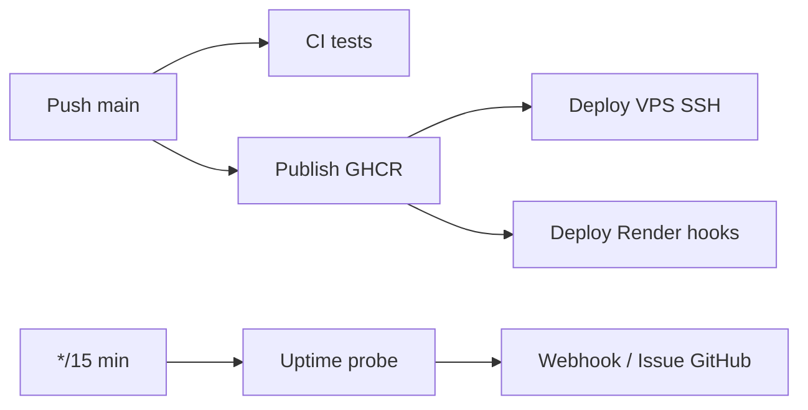

# PetfoodTN — CD (Continuous Deployment)

Guide pour publier les images Docker, déployer sur **VPS** ou **Render**, activer **HTTPS**, **Sentry** et les **alertes uptime**.

## Pipeline complet



| Workflow | Fichier | Déclencheur |
|----------|---------|-------------|
| CI | `ci.yml` | push/PR `main` |
| Publish images | `publish-ghcr.yml` | push `main`, tags `v*` |
| Deploy VPS | `deploy-vps.yml` | après publish OK |
| Deploy Render | `deploy-render.yml` | après publish OK |
| Uptime | `uptime.yml` | toutes les 15 min |

---

## 1. Publication GHCR (GitHub Container Registry)

Images produites à chaque push sur `main` :

| Image | Exemple |
|-------|---------|
| Frontend | `ghcr.io/ghassenel/petfoodtn-frontend:latest` |
| Backend | `ghcr.io/ghassenel/petfoodtn-backend:latest` |
| ML | `ghcr.io/ghassenel/petfoodtn-ml:latest` |

Tags : `latest`, `sha-abc1234`, `v1.2.3` (sur tag git).

**Rendre les packages publics** (recommandé pour VPS sans token) :
GitHub → Packages → petfoodtn-frontend → Package settings → Change visibility → Public.

---

## 2. Déploiement VPS (CD automatique)

### Prérequis serveur

```bash
# Sur Ubuntu/Debian (root)
bash scripts/devops/vps-bootstrap.sh /opt/petfoodtn
nano /opt/petfoodtn/.env.docker
```

Variables **obligatoires** dans `.env.docker` :

```env
DOMAIN=app.petfoodtn.tn
ACME_EMAIL=admin@petfoodtn.tn
CORS_ORIGINS=https://app.petfoodtn.tn
JWT_SECRET=<secret-fort-48-chars>
POSTGRES_PASSWORD=<mot-de-passe-fort>
GHCR_OWNER=ghassenel
```

DNS : enregistrement **A** `app.petfoodtn.tn` → IP du VPS. Ports **80** et **443** ouverts.

### Secrets GitHub (Settings → Secrets → Actions)

| Secret | Description |
|--------|-------------|
| `VPS_HOST` | IP ou hostname du VPS |
| `VPS_USER` | Utilisateur SSH (ex. `deploy`) |
| `VPS_SSH_KEY` | Clé privée SSH (PEM) |
| `VPS_DEPLOY_PATH` | `/opt/petfoodtn` |
| `VPS_SSH_PORT` | `22` (optionnel) |
| `GHCR_PULL_TOKEN` | PAT GitHub `read:packages` (si images privées) |

### Environnement GitHub

Créer l'environnement **production** (Settings → Environments) avec protection optionnelle (reviewers).

### Déploiement manuel

Actions → **Deploy VPS** → Run workflow → tag `latest` ou `sha-xxxxxxx`.

### Stack HTTPS sur VPS

```bash
docker compose \
  -f docker-compose.yml \
  -f docker-compose.ghcr.yml \
  -f docker-compose.ml.yml \
  -f docker-compose.prod.yml \
  -f docker-compose.caddy.yml \
  --env-file .env.docker \
  up -d
```

Caddy obtient automatiquement un certificat Let's Encrypt pour `DOMAIN`.

---

## 3. Déploiement Render

Guide détaillé : **[RENDER-SETUP.md](./RENDER-SETUP.md)** (pas à pas).

```powershell
npm run devops:render:setup
```

### Blueprint frontend (ce repo)

1. Render → **New** → **Blueprint** → `GhassenEl/frontend-petfood`
2. Crée : `petfoodtn-db`, `petfoodtn-web`, `petfoodtn-ml`

### Blueprint backend (repo séparé)

Copier `docs/render-backend.yaml` → `render.yaml` dans **backend-petfood**, puis Blueprint sur ce repo.

### Variables clés

| Service | Variable | Exemple |
|---------|----------|---------|
| `petfoodtn-web` | `VITE_API_BASE` | `https://petfoodtn-api.onrender.com/api` |
| `petfoodtn-api` | `CORS_ORIGINS` | `https://petfoodtn-web.onrender.com` |
| `petfoodtn-api` | `FASTAPI_URL` | `https://petfoodtn-ml.onrender.com` |

### Deploy Hooks (CD auto)

| Secret GitHub | Service |
|---------------|---------|
| `RENDER_DEPLOY_HOOK_FRONTEND` | petfoodtn-web |
| `RENDER_DEPLOY_HOOK_BACKEND` | petfoodtn-api |
| `RENDER_DEPLOY_HOOK_ML` | petfoodtn-ml |

---

## 4. Sentry (monitoring erreurs frontend)

1. Créer un projet sur [sentry.io](https://sentry.io) (React).
2. Copier le **DSN**.

| Où | Variable |
|----|----------|
| Build Docker / GHCR | Secret GitHub `VITE_SENTRY_DSN` |
| Dev local | `.env` → `VITE_SENTRY_DSN=https://…@sentry.io/…` |
| Release | `VITE_APP_RELEASE=petfoodtn@1.0.0` |

Le SDK s’active uniquement si le DSN est présent (`src/utils/sentry.js`).

Backend Sentry (optionnel) : ajouter `@sentry/node` dans `backend-petfood`.

---

## 5. Uptime & alertes

### GitHub Actions (inclus)

Workflow `uptime.yml` — toutes les **15 minutes**.

| Secret | Exemple |
|--------|---------|
| `UPTIME_FRONTEND_URL` | `https://app.petfoodtn.tn` |
| `UPTIME_BACKEND_URL` | `https://app.petfoodtn.tn` (via `/health` proxy) |
| `UPTIME_ML_URL` | `https://ml.petfoodtn.tn` (si exposé) |
| `ALERT_WEBHOOK_URL` | Webhook Slack / Discord / n8n |

En échec sans webhook → **issue GitHub** automatique (labels `incident`, `devops`).

### UptimeRobot (externe, recommandé)

Créer 3 monitors HTTP(S) :
- `https://app.petfoodtn.tn/nginx-health` — keyword `ok`
- `https://app.petfoodtn.tn/health` — JSON `"status":"healthy"`
- Alertes e-mail / SMS / Telegram

---

## 6. Commandes npm

```bash
npm run docker:ghcr:pull    # pull images GHCR
npm run docker:https:up     # prod + Caddy HTTPS
```

---

## Checklist mise en production

- [ ] Secrets `.env.docker` forts (JWT, PostgreSQL)
- [ ] `DEMO_MODE=false`, `RUN_SEED=false`
- [ ] `CORS_ORIGINS` = domaine HTTPS réel
- [ ] DNS + ports 80/443
- [ ] Secrets GitHub VPS ou Render configurés
- [ ] `VITE_SENTRY_DSN` dans secrets publish
- [ ] `UPTIME_*_URL` + `ALERT_WEBHOOK_URL`
- [ ] Sauvegardes PostgreSQL (`pg_dump` planifié)
- [ ] Packages GHCR publics ou `GHCR_PULL_TOKEN` sur VPS

---

## Dépannage CD

| Problème | Solution |
|----------|----------|
| `denied` au pull GHCR | Package public ou `GHCR_PULL_TOKEN` + `docker login` |
| Certificat Caddy échoue | Vérifier DNS, port 80, `DOMAIN` et `ACME_EMAIL` |
| Deploy VPS ne part pas | Vérifier environnement `production` + secrets SSH |
| Render hook 404 | Regénérer Deploy Hook dans Render |
| Sentry vide | Vérifier `VITE_SENTRY_DSN` au **build** (pas au runtime) |

Voir aussi [DEVOPS.md](./DEVOPS.md).
