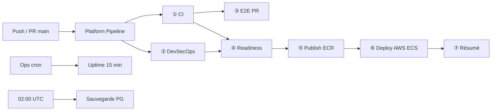

# PetfoodTN — Pipeline DevOps plateforme

Orchestrateur unifié : **`.github/workflows/platform-pipeline.yml`**

## Schéma



## Étapes

| # | Job | Workflow | PR | main |
|---|-----|----------|-----|------|
| ① | CI · Build & tests | `ci.yml` | ✅ | ✅ |
| ② | DevSecOps · Scans | `security.yml` | ✅ | ✅ |
| ③ | E2E · Playwright | `e2e.yml` | ✅ | dispatch |
| ④ | Readiness · Gate prod | `deployment-readiness.yml` | — | ✅ |
| ⑤ | Publish ECR | `publish-ecr.yml` | — | ✅ |
| ⑥ | Deploy AWS ECS | `deploy-aws.yml` | — | ✅ |
| ⑦ | Résumé pipeline | inline | — | ✅ |

## Déclencheurs

| Événement | Comportement |
|-----------|--------------|
| Push `main` | Pipeline complet → déploiement AWS |
| Pull Request | CI + DevSecOps + E2E (pas de deploy) |
| `workflow_dispatch` | Manuel — option `skip_deploy` |
| Tags `v*` | Publish ECR seul (`publish-ecr.yml`) |

## Secrets GitHub requis (production AWS)

| Secret / Variable | Usage |
|-------------------|--------|
| `AWS_ACCESS_KEY_ID` | Publish ECR + Deploy ECS |
| `AWS_SECRET_ACCESS_KEY` | Idem |
| `AWS_REGION` (var) | ex. `eu-west-3` |
| `AWS_ECS_CLUSTER` (var) | ex. `petfoodtn-production-cluster` |
| `AWS_ECR_PREFIX` (var) | ex. `petfoodtn-production` |
| `UPTIME_FRONTEND_URL` (var) | Health check post-deploy |
| `SONAR_TOKEN` | SonarQube (optionnel) |
| `VITE_SENTRY_DSN` | Build frontend (optionnel) |

## Commandes locales

```powershell
npm run devops:pipeline    # Audit fichiers pipeline
npm run devops:ci          # CI locale
npm run devops:aws:auto    # Terraform + 1er deploy AWS
npm run devops:health      # Santé stack locale
```

## Lancer manuellement (GitHub)

Actions → **Platform Pipeline** → Run workflow

- Cocher `skip_deploy` pour tester CI/Sec sans toucher AWS.

## Pipelines secondaires

| Workflow | Rôle |
|----------|------|
| `publish-ghcr.yml` | Images GHCR (VPS) |
| `deploy-vps.yml` | CD SSH docker-compose |
| `uptime.yml` | Sonde /health */15 min |
| `backup-nightly.yml` | pg_dump 02:00 UTC |
| `security.yml` (cron lun) | Scan hebdomadaire |

## Interface admin

- Hub public : `/devops`
- Hub admin : `/admin/devops` (onglet **CI / CD** — diagramme pipeline)

## Jenkins (labo)

Miroir du pipeline : `jenkins/Jenkinsfile`

---

Voir aussi [DEVOPS-PLATFORM.md](./DEVOPS-PLATFORM.md) · [AWS-SETUP.md](./AWS-SETUP.md) · [CD.md](./CD.md)
