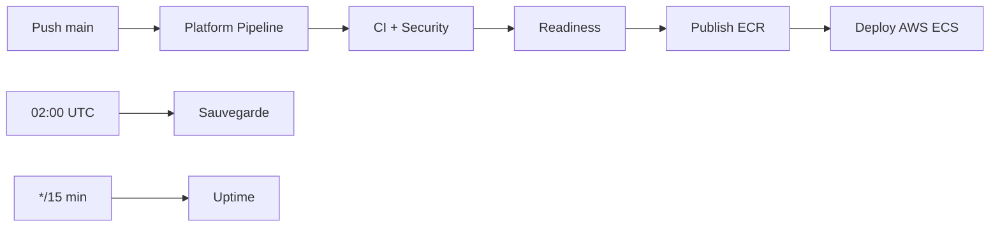

# PetfoodTN — Plateforme DevOps (CI/CD, Sécurité, Monitoring, IaC)

Guide PFE / production : intégration continue, déploiement continu, containerisation, observabilité, DevSecOps, infrastructure as code et sauvegardes.

> **Correspondance stack réelle vs cahier des charges**
>
> | Composant (cahier) | Implémentation PetfoodTN |
> |--------------------|--------------------------|
> | Frontend Flutter Web | **React/Vite** (web) + **Flutter** (`mobile_app/`) |
> | Backend Spring Boot | **Node.js Express** ([backend-petfood](https://github.com/GhassenEl/backend-petfood)) |
> | PostgreSQL | ✅ `postgres:16-alpine` |
> | MQTT Mosquitto | ✅ `docker-compose.iot.yml` |
> | Service IA | **FastAPI** (`fastapi_service/`) |
> | Service IoT | API Express + MQTT + VPN WireGuard + ESP32-CAM |

---

## 1. Intégration Continue (CI)

À chaque push/PR sur `main` :

| Étape | Outil | Workflow |
|-------|-------|----------|
| Récupération code GitHub | GitHub Actions | `checkout@v4` |
| Clone backend séparé | Action composite | `.github/actions/checkout-backend` |
| Build frontend Vite | Node 20 | `ci.yml` → `frontend-build` |
| Tests ML backend | Jest / npm | `ci.yml` → `backend-tests` |
| Tests API wallet | Node | `ci.yml` → `api-tests` |
| Smoke FastAPI | Python 3.12 | `ci.yml` → `ml-service` |
| Build Docker | Docker Compose | `ci.yml` → `docker-build` |
| Qualité code SonarQube | SonarScanner | `ci.yml` → `sonarqube` |
| E2E Playwright | Playwright | `e2e.yml` |

### Secrets SonarQube (optionnel)

| Secret | Description |
|--------|-------------|
| `SONAR_TOKEN` | Token projet SonarQube |
| `SONAR_HOST_URL` | Ex. `https://sonarcloud.io` |

Fichier : `sonar-project.properties`

### CI locale

```powershell
.\scripts\devops\ci-local.ps1
.\scripts\devops\ci-local.ps1 -WithMl
```

```bash
npm run devops:ci
```

### Jenkins (alternative / labo)

Pipeline déclaratif : `jenkins/Jenkinsfile` — miroir GitHub Actions (build, tests, OWASP, SonarQube, Trivy, push GHCR, deploy VPS).

---

## 2. Déploiement Continu (CD)

Pipeline orchestré par **`platform-pipeline.yml`** :



| Workflow | Rôle |
|----------|------|
| **`platform-pipeline.yml`** | **Orchestrateur** CI → Sec → E2E → Readiness → ECR → AWS |
| `ci.yml` | Build Vite, tests backend, ML, Docker |
| `security.yml` | Gitleaks, Trivy, OWASP, npm audit |
| `publish-ecr.yml` | Images → **Amazon ECR** |
| `deploy-aws.yml` | Rolling deploy **ECS Fargate** |
| `publish-ghcr.yml` | Images GHCR (VPS secondaire) |
| `deploy-vps.yml` | CD SSH docker-compose |
| `backup-nightly.yml` | Sauvegarde 02:00 UTC |
| `uptime.yml` | Sonde `/health` toutes les 15 min |

Guide pipeline : **[DEVOPS-PIPELINE.md](./DEVOPS-PIPELINE.md)**

Guide AWS : **[AWS-SETUP.md](./AWS-SETUP.md)** · CD : **[CD.md](./CD.md)**

---

## 3. Containerisation

Chaque composant est isolé dans un conteneur Docker :

| Service | Image / Dockerfile | Port |
|---------|-------------------|------|
| Frontend React | `Dockerfile.frontend` | 8080 |
| Backend Node.js | `backend/Dockerfile` | 5002 |
| PostgreSQL | `postgres:16-alpine` | 5432 |
| Service IA FastAPI | `fastapi_service/Dockerfile` | 8000 |
| MQTT Mosquitto | `eclipse-mosquitto:2` | 1883 / 9001 |
| VPN IoT | `linuxserver/wireguard` | 51820/udp |
| App mobile Flutter | Build natif (`mobile_app/`) | — |

### Fichiers Compose

| Fichier | Overlay |
|---------|---------|
| `docker-compose.yml` | Base : db + backend + frontend |
| `docker-compose.ml.yml` | + FastAPI IA |
| `docker-compose.iot.yml` | + Mosquitto MQTT |
| `docker-compose.monitoring.yml` | + Prometheus + Grafana |
| `docker-compose.prod.yml` | Production (no seed) |
| `docker-compose.ghcr.yml` | Images GHCR (CD) |
| `docker-compose.caddy.yml` | HTTPS Let's Encrypt |
| `docker-compose.vpn.yml` | WireGuard distributeurs |

### Commandes

```bash
# Stack standard
npm run docker:up

# + IA + MQTT + monitoring (stack complète DevOps)
npm run docker:stack:full

# MQTT seul
npm run docker:iot:up

# Monitoring Prometheus + Grafana
npm run docker:monitoring:up
```

Topics MQTT : `petfood/feeder/{id}/status`, `petfood/esp32cam/{id}/frame`, `petfood/sensor/{id}/telemetry`

---

## 4. Monitoring temps réel

### Outils

| Outil | Rôle |
|-------|------|
| **Prometheus** | Collecte métriques (scrape 15s) |
| **Grafana** | Dashboards CPU, RAM, commandes, IoT |
| **node-exporter** | CPU / RAM hôte |
| **cAdvisor** | CPU / RAM conteneurs |
| **blackbox-exporter** | Latence API `/health` |
| **metrics-exporter** | Métriques métier PetfoodTN |

### Métriques surveillées

| Métrique | Source |
|----------|--------|
| CPU / RAM | node-exporter, cAdvisor |
| Nombre de commandes | `petfood_orders_total` |
| Caméras ESP32-CAM | `petfood_esp32_cam_connected` |
| Capteurs IoT actifs | `petfood_iot_sensors_active` |
| Temps réponse API | `petfood_api_latency_ms`, blackbox |
| Qualité modèle IA | `petfood_ml_model_quality_score` |
| Disponibilité capteurs | blackbox + API IoT |

### Accès local

| Service | URL |
|---------|-----|
| Grafana | http://localhost:3000 (admin / voir `.env.docker`) |
| Prometheus | http://localhost:9090 |
| Metrics exporter | http://localhost:9105/metrics |

Dashboard : `infra/monitoring/grafana/dashboards/petfoodtn-overview.json`

### Pipeline de surveillance automatique

- **Uptime** : `uptime.yml` — API, frontend, ML toutes les 15 min
- **Health local** : `npm run devops:health`
- **Alertes** : webhook Slack/Discord ou issue GitHub automatique

---

## 5. DevSecOps (Sécurité)

Workflow : `.github/workflows/security.yml`

| Contrôle | Outil |
|----------|-------|
| Scan dépendances npm | `npm audit` |
| Analyse CVE libraries | **OWASP Dependency-Check** |
| Scan images Docker | **Trivy** |
| Secrets exposés | **Gitleaks** |
| Qualité + vulnérabilités code | **SonarQube** (Security Hotspots) |
| Contrôle accès API | JWT + rôles (`RoleRoute`) + CORS production |

Planification : scan sécurité hebdomadaire (lundi 03:00 UTC) + chaque push/PR.

Rapports OWASP : artefact GitHub Actions `owasp-dependency-check` (14 jours).

---

## 6. Infrastructure as Code (IaC)

### Terraform — provisionnement cloud

```bash
cd infra/terraform
cp terraform.tfvars.example terraform.tfvars
# Éditer do_token, ssh_key_fingerprint
terraform init
terraform plan
terraform apply
```

Crée : droplet Ubuntu, firewall (22, 80, 443, 51820/udp), Docker pré-installé.

### Ansible — configuration serveur

```bash
cd infra/ansible
# Éditer inventory.ini (IP VPS)
ansible-playbook -i inventory.ini playbook.yml
```

Installe : Docker, clone repo, pull GHCR, `docker compose up`, cron sauvegarde.

### Kubernetes (optionnel)

Manifests : `infra/k8s/`

```bash
kubectl apply -f infra/k8s/namespace.yaml
kubectl apply -f infra/k8s/
```

Déploie : frontend, backend, PostgreSQL StatefulSet, ML, MQTT.

---

## 7. Sauvegarde automatique

Chaque nuit (02:00 UTC via GitHub Actions ou cron Ansible) :

| Élément | Fichier |
|---------|---------|
| PostgreSQL | `postgres.sql.gz` |
| Images ESP32-CAM / uploads | `backend-uploads.tar.gz` |
| Modèles IA | `ml-models.tar.gz` |
| Rétention | 14 jours |

### Manuel

```bash
# Linux / VPS
DEPLOY_PATH=/opt/petfoodtn bash scripts/devops/backup-nightly.sh

# Windows
.\scripts\devops\backup-nightly.ps1
npm run devops:backup
```

Secrets requis workflow `backup-nightly.yml` : `VPS_HOST`, `VPS_USER`, `VPS_SSH_KEY`, `VPS_DEPLOY_PATH`.

---

## 8. Surveillance pipeline IoT & IA

Le pipeline DevOps surveille automatiquement :

| Domaine | Mécanisme |
|---------|-----------|
| Disponibilité capteurs | MQTT health + métriques `petfood_iot_sensors_active` |
| Temps de réponse API | blackbox-exporter + `petfood_api_latency_ms` |
| Qualité modèles IA | `petfood_ml_model_quality_score` + tests `test:ml` en CI |
| Erreurs équipements IoT | Alertes `iot_food_quality` + uptime + logs backend |

---

## Structure du repo DevOps

```
.github/workflows/
  ci.yml              # CI complet + SonarQube
  security.yml        # DevSecOps (Trivy, OWASP, Gitleaks)
  publish-ghcr.yml    # CD images
  deploy-vps.yml      # CD serveur
  backup-nightly.yml  # Sauvegardes
  uptime.yml          # Monitoring disponibilité
jenkins/Jenkinsfile   # Pipeline Jenkins
infra/
  terraform/          # IaC cloud
  ansible/            # Configuration serveur
  k8s/                # Kubernetes
  mqtt/               # Config Mosquitto
  monitoring/         # Prometheus, Grafana, exporters
docker-compose*.yml
scripts/devops/
  backup-nightly.sh
  health-check.mjs
  ci-local.ps1
docs/
  DEVOPS.md           # Guide opérationnel
  DEVOPS-PLATFORM.md  # Ce document (architecture PFE)
  CD.md               # Déploiement continu
```

---

## Checklist mise en production

1. Configurer secrets GitHub : SonarQube, VPS, uptime URLs, webhook alertes
2. `cp .env.docker.example .env.docker` — secrets forts
3. `npm run docker:stack:full` ou deploy VPS via CD
4. Ouvrir Grafana → dashboard **PetfoodTN — Monitoring temps réel**
5. Vérifier `npm run devops:health -- --docker`
6. Tester sauvegarde : `npm run devops:backup`
7. Activer Dependabot (déjà : `.github/dependabot.yml`)

Voir aussi : [DEVOPS.md](./DEVOPS.md) pour le quotidien développeur.
