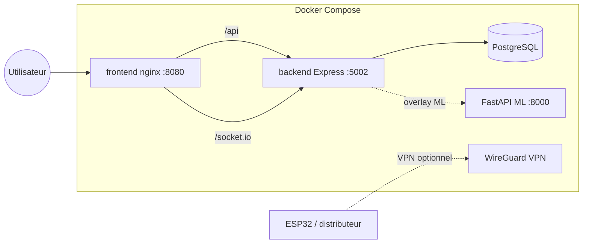

# PetfoodTN — DevOps

Guide d'exploitation : CI/CD, Docker, santé des services et déploiement.

## Architecture runtime

> **Note CI** : le dossier `backend/` est dans `.gitignore` (repo séparé [backend-petfood](https://github.com/GhassenEl/backend-petfood)).  
> GitHub Actions clone automatiquement ce repo via `.github/actions/checkout-backend`.



| Service | Image / build | Port hôte | Health |
|---------|---------------|-----------|--------|
| `frontend` | `Dockerfile.frontend` | 8080 | `GET /nginx-health` |
| `backend` | `backend/Dockerfile` | 5002 | `GET /health` |
| `db` | `postgres:16-alpine` | — | `pg_isready` |
| `ml` (overlay) | `fastapi_service/Dockerfile` | 8000 | `GET /health` |
| `wireguard` (overlay) | linuxserver/wireguard | 51820/udp | — |

## Prérequis

- **Node.js 20** — frontend + backend
- **Python 3.12** — service ML (dev local)
- **Docker Desktop** — déploiement conteneurisé
- **Git** — CI/CD GitHub Actions

## Développement local

```bash
npm install
npm --prefix backend install

# Frontend + backend
npm run dev

# Stack complète (web + API + ML)
npm run dev:full
```

Variables : copier `.env.example` (frontend) et `backend/.env` depuis les exemples du repo.

## Docker — commandes rapides

```bash
# Copier la config
cp .env.docker.example .env.docker
# Éditer JWT_SECRET et POSTGRES_PASSWORD

# Stack standard (frontend + backend + PostgreSQL)
npm run docker:up

# Stack + service ML FastAPI
npm run docker:ml:up

# Stack production (pas de seed, DEMO_MODE=false)
npm run docker:prod:up

# Stack complète ML + VPN IoT
npm run docker:full:up

# Arrêt / logs / santé
npm run docker:down
npm run docker:logs
npm run devops:health -- --docker
```

### Windows (one-click)

```powershell
.\scripts\docker-deploy.ps1          # installe Docker si besoin + stack standard
.\scripts\docker-deploy.ps1 -WithMl  # avec FastAPI ML
.\scripts\docker-deploy.ps1 -Prod    # overlay production
```

Comptes démo après seed : `admin@petfood.tn` / `PetfoodTN2024!`

## Fichiers Compose

| Fichier | Rôle |
|---------|------|
| `docker-compose.yml` | Base : db, backend, frontend |
| `docker-compose.ml.yml` | Ajoute `ml` + lien backend → FastAPI |
| `docker-compose.prod.yml` | `RUN_SEED=false`, logs rotatifs, restart always |
| `docker-compose.vpn.yml` | WireGuard pour distributeurs IoT |

Exemple manuel :

```bash
docker compose \
  -f docker-compose.yml \
  -f docker-compose.ml.yml \
  -f docker-compose.prod.yml \
  --env-file .env.docker \
  up -d --build
```

## CI/CD (GitHub Actions)

| Workflow | Déclencheur | Jobs |
|----------|-------------|------|
| `.github/workflows/ci.yml` | push/PR `main` | build Vite, tests ML backend, smoke FastAPI, `docker compose build` |
| `.github/workflows/e2e.yml` | push/PR `main` | Playwright E2E + tests API wallet |
| `.github/dependabot.yml` | hebdo | npm (frontend/backend), pip (ML), GitHub Actions |

### CI locale (avant push)

```powershell
.\scripts\devops\ci-local.ps1
.\scripts\devops\ci-local.ps1 -WithMl
```

```bash
npm run devops:ci
npm run build
npm --prefix backend run test:ml
```

## Santé & observabilité

```bash
# Dev (Vite :3001)
npm run devops:health

# Docker (:8080)
npm run devops:health -- --docker

# Inclure FastAPI ML
CHECK_ML=1 npm run devops:health
```

Endpoints utiles :

- `http://localhost:8080/nginx-health` — nginx (Docker)
- `http://localhost:5002/health` — API Express
- `http://localhost:8000/health` — ML FastAPI

Logs conteneurs :

```bash
docker compose --env-file .env.docker logs -f backend
docker compose --env-file .env.docker ps
```

## Tests

| Commande | Description |
|----------|-------------|
| `npm run test:api` | Tests API wallet / vaccins |
| `npm run test:ml` | Tests architectures ML (backend) |
| `npm run test:e2e` | Playwright (serveurs requis) |
| `npm test` | Attente serveurs + API + E2E |

## Déploiement production — checklist

1. Générer des secrets forts dans `.env.docker` (`JWT_SECRET`, `POSTGRES_PASSWORD`).
2. `DEMO_MODE=false`, `RUN_SEED=false` (overlay `docker-compose.prod.yml`).
3. Configurer `CORS_ORIGINS` avec le domaine réel.
4. Stripe : `STRIPE_SECRET_KEY` + `STRIPE_MOCK=0`.
5. Firebase (IoT) : variables dans `backend/.env` — voir `firebase/README.md`.
6. HTTPS : placer un reverse proxy (Traefik, Caddy, Nginx) devant le port 8080.
7. Sauvegardes PostgreSQL : volume `pgdata` — planifier `pg_dump` régulier.

## VPN IoT (optionnel)

Voir [docs/VPN.md](./VPN.md).

```bash
npm run docker:vpn:up
# Configs clients : ./vpn/config/peer1/
```

## Dépannage

| Symptôme | Action |
|----------|--------|
| Port 5002 occupé | `backend/scripts/free-port.ps1` ou arrêter l'ancien Node |
| `docker compose` échoue au build | `docker compose build --no-cache` |
| Frontend 502 sur `/api` | `docker compose logs backend` — attendre healthcheck DB |
| E2E timeout CI | Vérifier `scripts/wait-for-servers.js` et `PLAYWRIGHT_BASE_URL` |
| ML indisponible | Lancer overlay ML ou `npm run dev:ml` |

## Structure DevOps du repo

```
.github/workflows/
  ci.yml          # build + tests + docker build
  e2e.yml         # tests bout-en-bout
scripts/devops/
  health-check.mjs
  ci-local.ps1
docker/
  nginx.conf      # reverse proxy SPA + API
docker-compose*.yml
Dockerfile.frontend
backend/Dockerfile
fastapi_service/Dockerfile
```
